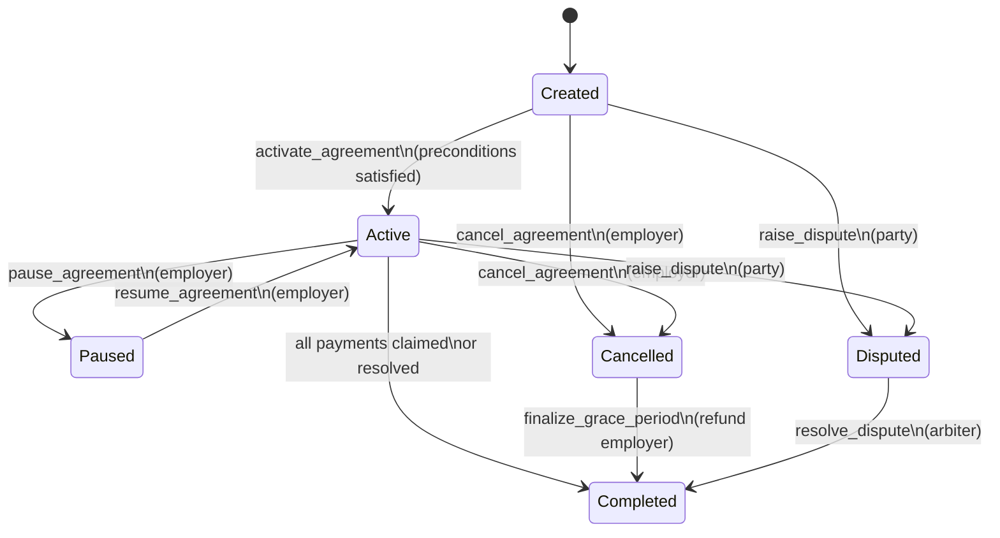
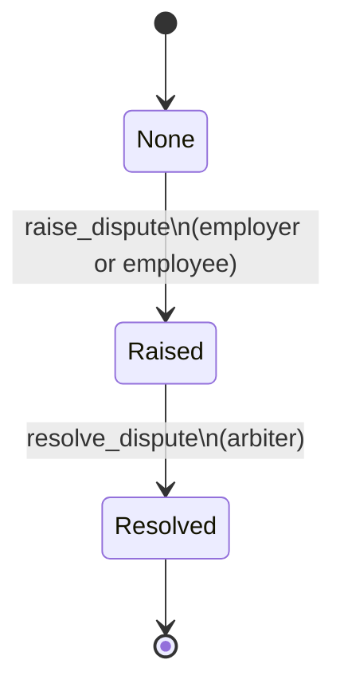

## Agreement State Machines

This document provides a high-level, implementation-aligned view of the main state machines in the payroll contract, focusing on **agreement lifecycle**, **disputes**, and **grace-period cancellation**.

It is intentionally minimal, but accurate enough to guide reviews, audits, and integration work.

---

### Core Agreement Lifecycle

On-chain type: `AgreementStatus` (see `onchain/contracts/stello_pay_contract/src/storage.rs`).

States:

- `Created`: agreement exists but is not yet activated
- `Active`: agreement is live, and payments/claims are allowed
- `Paused`: agreement temporarily suspended
- `Cancelled`: employer has cancelled; grace-period refund flow applies
- `Completed`: agreement fully settled (all funds distributed or refunded)
- `Disputed`: a dispute has been raised and must be resolved

#### State Diagram

#### Main Transitions and Conditions

- **`Created → Active`**
  - Trigger: `activate_agreement`
  - Conditions:
    - Agreement exists
    - For payroll mode: at least one employee added
    - Caller is employer
  - Effects:
    - `status = Active`
    - `activated_at` set to current ledger timestamp

- **`Active ↔ Paused`**
  - `Active → Paused`
    - Trigger: `pause_agreement`
    - Conditions: caller is employer; status is `Active`
    - Effects: `status = Paused`
  - `Paused → Active`
    - Trigger: `resume_agreement`
    - Conditions: caller is employer; status is `Paused`
    - Effects: `status = Active`

- **`Created/Active → Cancelled`**
  - Trigger: `cancel_agreement`
  - Conditions:
    - Caller is employer
    - Status is `Created` or `Active`
  - Effects:
    - `status = Cancelled`
    - `cancelled_at` set to current timestamp
    - Grace period window becomes active (`grace_period_seconds`)

- **`Cancelled → Completed`**
  - Trigger: `finalize_grace_period`
  - Conditions:
    - Status is `Cancelled`
    - Grace period has fully elapsed
  - Effects:
    - Remaining escrow refunded to employer
    - Agreement marked logically complete (no further claims expected)

- **`Active → Completed`**
  - Trigger: last payment / last milestone claim / dispute resolution
  - Conditions:
    - All funds have been distributed according to the agreement
  - Effects:
    - `status = Completed`

---

### Dispute Lifecycle

On-chain type: `DisputeStatus` and the `dispute_status` field on `Agreement`.

States:

- `None`: default, no active dispute
- `Raised`: dispute opened by employer or employee
- `Resolved`: dispute resolved by arbiter

#### State Diagram

#### Transitions and Conditions

- **`None → Raised`**
  - Trigger: `raise_dispute`
  - Conditions:
    - Caller is employer or participant in the agreement
    - No existing active dispute
  - Effects:
    - `dispute_status = Raised`
    - `DisputeStatus` storage updated; `dispute_raised_at` set

- **`Raised → Resolved`**
  - Trigger: `resolve_dispute`
  - Conditions:
    - Caller is configured arbiter
    - Payout split (`pay_employee`, `refund_employer`) does not exceed total locked funds
  - Effects:
    - Funds distributed according to arbiter decision
    - `dispute_status = Resolved`
    - Agreement typically transitions to `Completed`

Error states (see `PayrollError`):

- `DisputeAlreadyRaised`, `NotParty`, `NotArbiter`, `InvalidPayout`, `ActiveDispute`, `NoDispute`
- These correspond to:
  - double-raise attempts
  - unauthorized callers
  - over-allocating beyond total locked amount
  - conflicting lifecycle (e.g., trying to finalize while dispute is active)

---

### Grace-Period and Cancellation Flow

The grace-period flow ties cancellation and finalization together.

High-level:

1. **Employer cancels** an `Active` or `Created` agreement:
   - status becomes `Cancelled`
   - `cancelled_at` set
2. **Grace period** (`grace_period_seconds`) begins:
   - Claims may still be allowed during this window
   - Refunds are blocked until the window has expired
3. **Finalization**:
   - After the grace period, employer calls `finalize_grace_period`
   - Remaining escrow is refunded and the agreement is effectively completed

This flow is validated in the `test_grace_period.rs` suite and underpins all time-based termination behavior for agreements.

